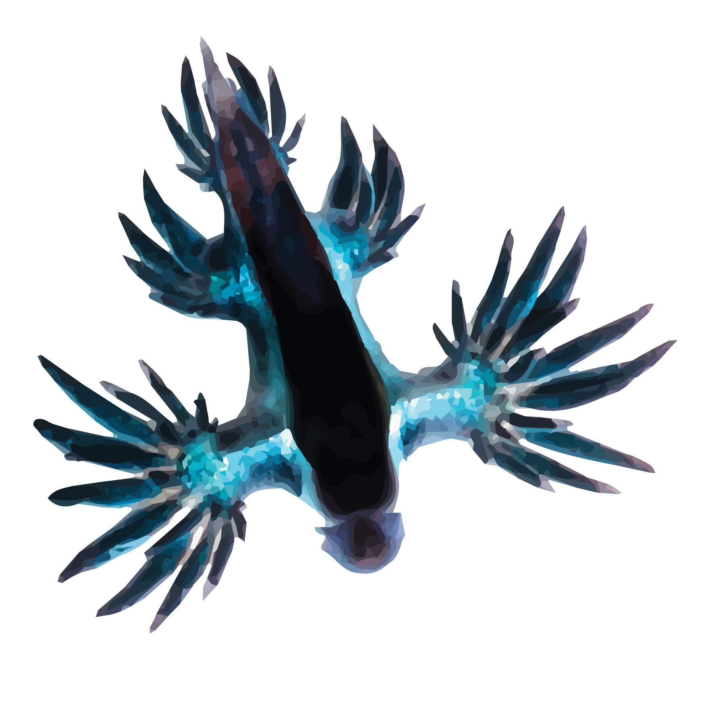

.. _about:

About |project|
===============

.. image:: _static/logo_Color_trimmed.png
    :width: 80%

|project| is an open source project released by aiCTX AG.

.. image:: https://img.shields.io/pypi/v/rockpool
   :target: https://pypi.org/project/rockpool/

.. image:: https://img.shields.io/conda/v/conda-forge/rockpool
   :target: https://anaconda.org/conda-forge/rockpool

.. image:: https://img.shields.io/pypi/pyversions/rockpool?logo=python
   :target: https://pypi.org/project/rockpool/

.. image:: https://img.shields.io/badge/code_style-black-000000

.. image:: https://img.shields.io/pypi/dd/rockpool
   :target: https://pypi.org/project/rockpool/

.. image:: https://zenodo.org/badge/DOI/10.5281/zenodo.3773845.svg
   :target: https://doi.org/10.5281/zenodo.3773845

About aiCTX
-----------

aiCTX_ is a Neuromorphic computing hardware and solutions startup, based in Zurich Switzerland. The company specializes in developing mixed-signal neuromorphic silicon hardware for neural simulation and signal processing; it develops software for interfacing with and configuring neuromorphic hardware; and develops solutions to analyse and process bio-signals. aiCTX_ is a commercial spin-off from the Institute of Neuroinformatics (INI_), University of Zurich (UZH_) and ETH Zurich (ETHZ_).

.. _aiCTX: https://aictx.ai
.. _INI: https://ini.uzh.ch
.. _UZH: https://uzh.ch
.. _ETHZ: https://ethz.ch

About Noodle
------------

Noodle is the mascot of |project|. Noodle is a Nudibranch_, `Glaucus marginatus`_. Nudibranches are a group of amazing sea snails that shed their shells after the larval stage, to display an incredible array of forms, patterns and colours. `Glaucus marginatus`_ is a species found in the Pacific ocean, and often seen at beaches and in rock pools of the eastern Australian coast.

Photograph of Noodle is `CC BY 2.0`_ `Taro Taylor`_

.. _Nudibranch: https://en.wikipedia.org/wiki/Nudibranch
.. _Glaucus marginatus: https://en.wikipedia.org/wiki/Glaucus_marginatus

.. _CC BY 2.0: https://creativecommons.org/licenses/by/2.0/
.. _Taro Taylor: https://www.flickr.com/people/tjt195/
