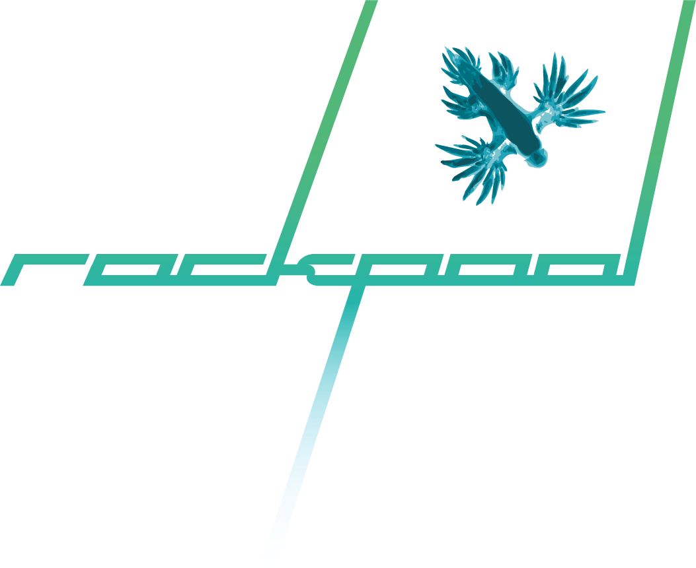

.. NetworksPython documentation master file, created by
   sphinx-quickstart on Mon Jun 24 12:12:37 2019.
   You can adapt this file completely to your liking, but it should at least
   contain the root `toctree` directive.

Welcome to |project|
================================

|project| is a Python package for working with dynamical neural networks architectures, particularly for designing event-driven
networks for Neuromorphic computing hardware. |project| provides a convenient interface for designing, training
and evaluating recurrent networks, which can operate both with continuous-time dynamics and event-driven dynamics.

|project| is an open-source project managed by aiCTX AG.

.. toctree::
   :maxdepth: 1

   about

.. toctree::
   :maxdepth: 2
   :caption: The basics

   basics/installation
   basics/time_series.ipynb
   basics/building_reservoir.ipynb

.. toctree::
   :maxdepth: 2
   :caption: Advanced topics

   advanced/extending_layers.ipynb

   reference/time_series
   reference/networks
   reference/layers
   reference/layer_types
   reference/extending
   reference/hardware

   reference/api

Indices and tables
==================

* :ref:`genindex`
* :ref:`modindex`
* :ref:`search`
